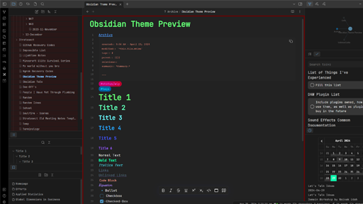

Based on the Spectrum and Obsidianotion themes but with a bit more of a blue color pallete.

Spectrum: https://github.com/wiktoriavh/Spectrum
Obsidianotion: https://github.com/diegoeis/Obsidianotion
Jetbrains Mono: https://www.jetbrains.com/lp/mono/

Script was entirely rewritten by me but takes inspiration and snipets from both of these themes. The font is open-source called Jetbrains Mono.

This is mainly a theme for personal use and likely contains bugs / errors...

